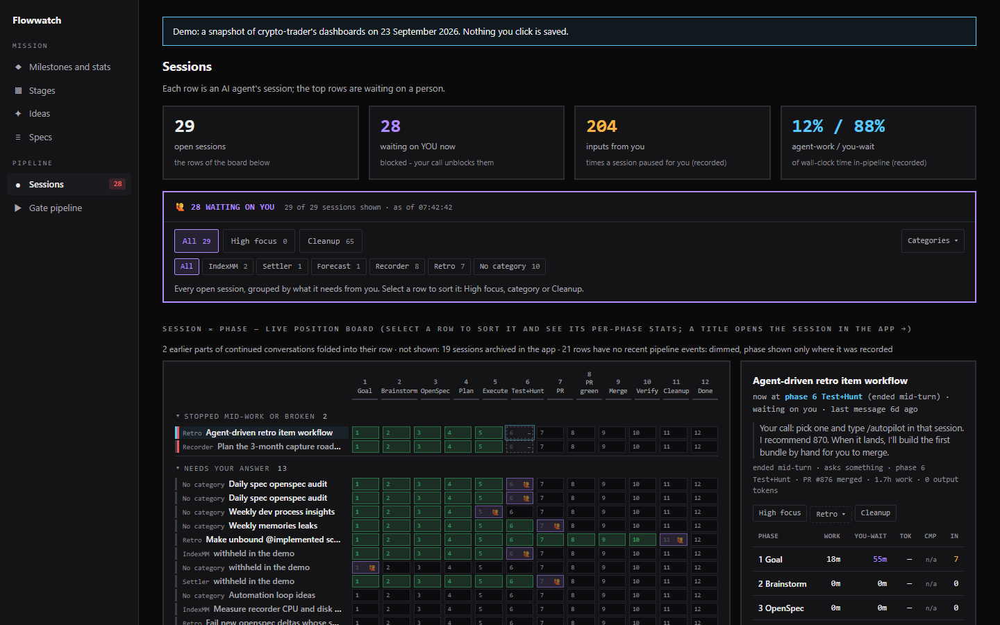
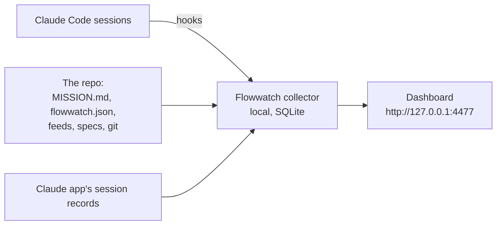

# Flowwatch

**See how work flows through a fleet of AI coding agents toward a stated mission: where it moves, where it
waits, and who it waits on.**

[Live demo](https://lutzkempf.github.io/flowwatch/) · [Set it up](SETUP.md) · [How it works](docs/architecture.md)



## The problem

Point a dozen coding agents at a real project and you get a lot of activity: sessions, branches, pull
requests, test runs. Activity is the easy part to see and the wrong thing to manage. The questions that
decide whether a team gets value from its agents are about **flow**:

- **Where is work waiting, and on whom?** Most agent work stalls on a person: a question to answer, a plan
  to approve, a pull request to merge. Human attention is the scarce resource, and it should go where
  work is blocked, not to whoever asked last.
- **Is the work moving the mission?** Merged pull requests are a proxy. The outcome is what the project
  set out to achieve, measured the way the project measures it.
- **Where does work get stuck on the way?** A quality gate everyone queues for, a stage nothing passes, an
  idea that keeps coming back after it was ruled out.

Flowwatch answers those from what the agents already leave behind, on the machine where they run.

## What you see

- **Sessions.** Every Claude Code session, placed on the working phase it has reached (goal → brainstorm →
  plan → build → test → pull request → merge → verify → done). The ones waiting on a person come first, with what
  they are waiting for. Sort them, focus on some, hand finished ones to a clean-up session.
- **Mission.** The repo's mission, its focus and its milestones, and a few value figures measured in
  outcomes, as the repo defines them.
- **Gates.** What is running at the project's quality gate and what is queued behind it, in the order it
  will start, and how long a gate usually takes.
- **Stages.** How far each workstream has got through the stages the project defines, with evidence
  shown apart from assumption.
- **Ideas.** Every idea the project has tried, with its verdict, so a ruled-out idea stays ruled out.
- **Specs.** The behaviour contract, when the repo keeps one.

The [demo](https://lutzkempf.github.io/flowwatch/) is a snapshot of these dashboards on a real project,
crypto-trader, built by a fleet of Claude Code agents. Some text in it is withheld to keep that project
private; every number and the structure are real.

## How it works



- **Session hooks** send each session's events to a small collector on your machine. Nothing leaves it.
- **The repo says what matters.** `MISSION.md` holds the mission, focus, milestones and categories.
  `flowwatch.json` names the repo's own feeds for the optional panels: a command or a file that gives the
  value figures, the gate queue, the stages or the ideas in a [documented format](docs/formats.md).
- **Every panel is honest about what it knows.** It shows data, "not set up" (with the step that sets it
  up), "turned off", or an error with its reason. A missing number is never shown as zero.

## Set it up

```bash
npm install --save-dev github:LutzKempf/flowwatch#v1.0.0
npx flowwatch install-hooks
npx flowwatch start
```

Then write your `MISSION.md` (from [the template](templates/MISSION.md)) and run `npx flowwatch check`,
which lists what is still missing and exits 1 until the required parts are done. [SETUP.md](SETUP.md)
walks through every step, and is written so a coding agent can follow it alone: ask yours to.

Runs on Windows, macOS and Linux with Node 22, 24 or 26. Try the demo without installing anything:
`npx github:LutzKempf/flowwatch demo`.

## Design principles

- **Flow over activity.** The board is ordered by who is blocked, not by what happened last.
- **Absent is not zero.** A figure the tool cannot establish says "not recorded"; a panel with no source
  says "not set up", never "nothing to report".
- **The repo owns its meaning.** Flowwatch knows nothing about any project. Mission, milestones, stages and
  value come from files the repo keeps, in formats anyone can supply.
- **Local and read-only.** It listens on 127.0.0.1 only and makes no outbound calls. The dashboard only
  reads. Flowwatch writes to its own data folder, outside the repo unless you put it there, and to your repo
  only the hooks entry `install-hooks` adds when you run it. See [SECURITY.md](SECURITY.md).

## How it was built

Flowwatch was built with the agents it watches, under the same oversight it provides: a written design
reviewed before any code, a plan whose claims about behaviour were run rather than argued, tests written
before the code they pin, and an independent review before every merge. It has watched the project it
grew up in every day since, which is how most of its honesty rules were found.

## License

[MIT](LICENSE) © 2026 Lutz Kempf
