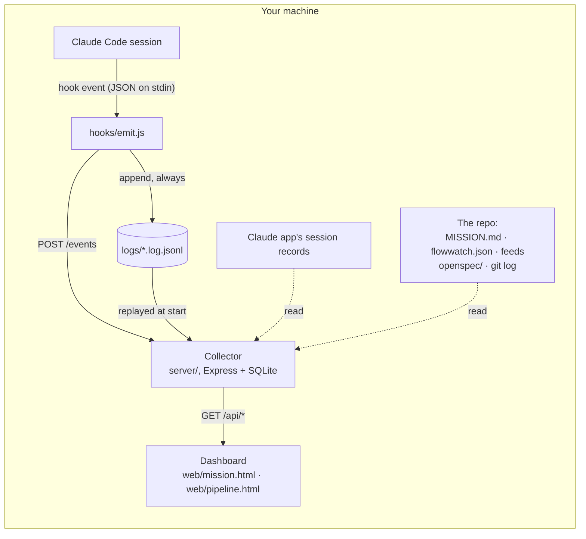

# How Flowwatch works

Flowwatch is three small parts that never leave your machine: **hooks** that report what each Claude Code
session does, a **collector** that keeps those reports and reads the repo, and a **dashboard** of two plain
web pages. There is no build step and no cloud service.

## The hooks (`hooks/`)

`npx flowwatch install-hooks` adds one command to the repo's `.claude/settings.json` for the session events
Flowwatch uses (start, prompt, tool use, stop, worktree removal). Claude Code runs it with the event on
standard input. The emitter turns the event into a small record — which session, which worktree, what
happened — appends it to a log file in the data folder, and posts it to the collector. The collector replays
the logs when it starts and drops events it already has (each carries an id), so an event sent while the
collector was down is not lost. Every hook ends in `|| true`: Flowwatch can never block or fail a session.

## The collector (`server/`)

An Express app on 127.0.0.1 (port 4477 unless the repo or `FLOWWATCH_PORT` says otherwise) with a SQLite
database in the data folder (`~/.flowwatch` unless `FLOWWATCH_DATA_DIR` or the repo says otherwise).

- **Sessions** (`server/sessions/`): each event moves its session along twelve working phases, from goal
  to done. Sessions are joined with the Claude desktop app's own records (titles, archived state), and past
  transcripts are imported once, so a new install starts with history. A session waiting on a person — a
  question, a finished turn, an error — is marked with what it waits for.
- **The repo** (`server/repo/`): `MISSION.md` (mission, focus, milestones, categories), `flowwatch.json`
  (what the optional panels read, and the folders where the repo's checks leave their results, which move
  a session to PR green and Verify), openspec specs and changes, and `git log` for merged work.
- **Panels** (`server/panels/`): value, stages, ideas and gates each come from a **feed** the repo names in
  `flowwatch.json` — a command run without a shell, or a file — in a [documented format](formats.md).
  `server/feeds.js` runs it with a time limit, never blocking the collector, and turns every failure into a
  state the panel shows with its reason.
- **Setup** (`server/setup/`): one list of what is set up and what is missing. The dashboard's banner and
  `npx flowwatch check` both show it.

## The dashboard (`web/`)

Two pages, `mission.html` and `pipeline.html`, sharing a sidebar (`web/lib/nav.js`, the one list of panels
the collector's routes use too), their colours (`web/lib/tokens.css`) and small render helpers. Each page is short
markup; its stylesheet and its ES modules, one job each (the board, the side panel, the gate queue, the polls…),
are in `web/pages/<page>/`, loaded by the browser as they are. They poll the collector's read-only API; the only
state they keep is the operator's own sorting, in the browser. Every panel has four honest states: data,
not set up (with the setup step), turned off, or an error with its reason.

## The demo (`demo/`)

The same pages, reading a snapshot of the API's answers from static files instead of a collector
(`web/lib/data.js` is the one place that decides). `npm run build:demo` builds the static site, and refuses
snapshot data nobody signed off; `npx flowwatch demo` serves it locally the way GitHub Pages serves it. In the
demo the clock stands at the snapshot's moment and nothing links into the Claude app.

## Settings and formats

- [settings.md](settings.md) — every key of `flowwatch.json`.
- [formats.md](formats.md) — the four feed formats, with an example each.
